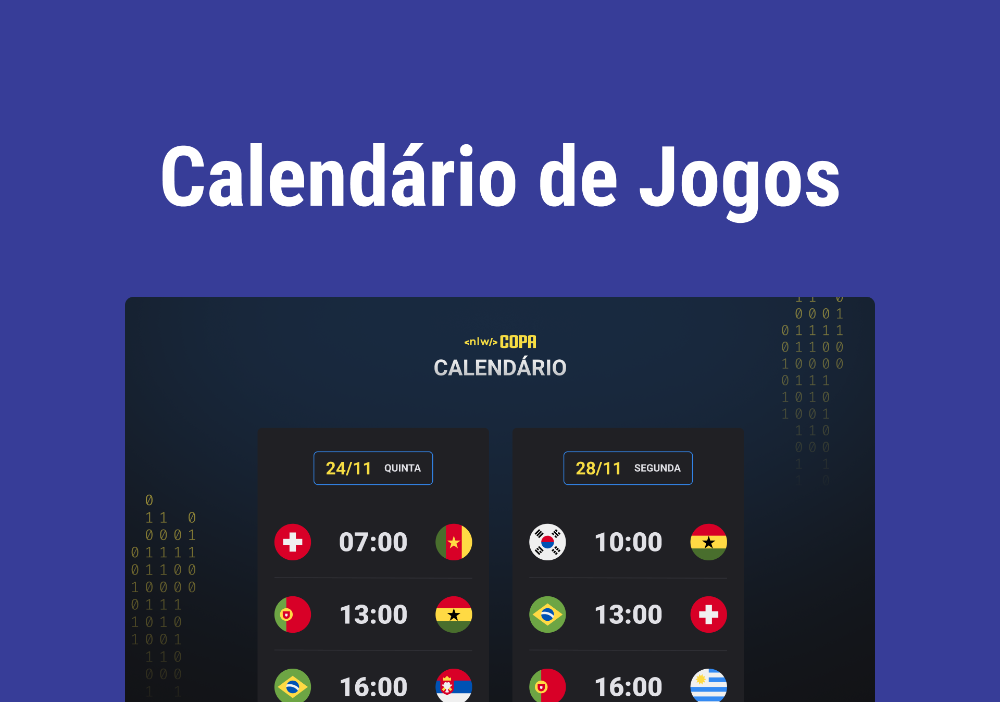

<h1 align="center">NLW 10 Copa </h1>

Evento exclusivo e gratuito, promovido pela Rocketseat para ensino de tecnologia WEB.

  <a href="tecnologias" style="border-bottom: 3px solid ">Tecnologias</a>&nbsp;&nbsp;&nbsp;&nbsp;
  <a href="projeto" style="border-bottom: 3px solid ">Projeto</a>&nbsp;&nbsp;&nbsp;&nbsp;
  <a href="layout" style="border-bottom: 3px solid ">Layout</a>&nbsp;&nbsp;&nbsp;&nbsp;

 

## Preview

---

      

<a href="https://brunogoncalvesferreira.github.io/world-cup-schedule/">Clique aqui e veja o projeto funcionando</a>

 

## Tecnologias

---

Esse projeto foi desenvolvido com as seguites tecnologias:

- HTML e CSS
- JavaScript
- GIT e GITHUB

 

## Projeto

---

O calendário da Copa é um projeto que mostra os jogos da copa do mundo de futebol 2022 no Qatar.

 

## Layout

---

Você pode visualizar o layout do projeto através [DESSE LINK](<https://www.figma.com/file/0nWaXPSVGMvXsKw5EyeYN7/Calend%C3%A1rio-de-Jogos-(Community)?node-id=0%3A1>). É necessário ter uma conta no [FIGMA](https://www.figma.com) para acessá-lo.

 

## Autor

---

 
<a href="https://www.linkedin.com/bruno-goncalves-ferreira">Bruno Gonçalves Ferreira</a>
